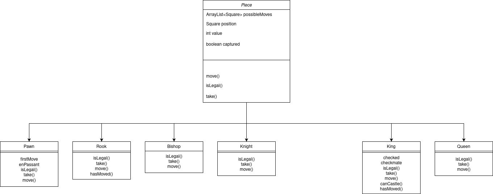

# Technical Details:

We will have a Piece class that is the parent class, and subclasses will be Pawn, Bishop, Knight, King, Queen, Rook.

We will use processing to display the board.

NOTE: MOST CLASSES WILL BE SUBJECT TO CHANGE FROM THE PROTOTYPE SINCE IT IS NOT PERFECT. THE MAIN EXAMPLE OF THIS IS THE USAGE OF A Piece[][] FOR THE BOARD WITH 0 AS A "FREE PIECE" (empty space) THAT MAYBE CHANGED TO USE A SQUARE CLASS.

NOTE TO GROUP: WE NEED TO UPDATE UML DIAGRAMS

Board Class:

- Piece[][] ~field~ grid - subject to change, we may find having a 2d array better or need a separate "squares" class if things do not work out.
- [UPDATED] getPiece(int row, int col) - does exactly what it sounds like it does
- [NEW] placePiece(Piece piece, int row, int col) - places pieces at row col
- [NEW] removePiece(int row, int col) - removes piece at row col 

Piece Class (abstract class, like adventurer) :
- boolean isWhite
- int value
- constructor will take in a boolean and determine which color a piece is
- ~ArrayList of Integers~ ArrayList<int[]> moves (not entirely sure whether to make this an Integer arraylist to store positions or make it a chessboard with letter positions. Obviously in processing we will display it as with letters but this is just for coding.)
- take(int[] go) - takes a piece, updates counter for opposite boolean, removes piece from board.
- move(int[] go) - removes piece from position, places it at desired location, and checks if isLegal(). take() will call this.   
- isLegal(int[] go) - checks to see if move is legal. this method may be removed for displaying possible moves but is likely to be kept to stop broken moves.
We will have a counter for the value of the pieces taken.
- ~[NEW] ArrayList<int[]> legalMoves - returns ArrayList<int[]> moves~ decided to remove this feature, since we don't need this currently.
- [NEW] updateMoves() abstract method that changes for each child class to update possible moves. Needed to display where pieces can go when we make the procesing stuff.
- [NEW] boolean isWithinBounds(int[] go) determines if go is in the board. saves time as a helper method for updateMoves.
- [NEW] contains(int[] go) checks if possibleMoves has int[] go. contains() doesn't work on arraylist of arrays.

Pawn:
- boolean firstMove. Determines if a pawn can move forward two spaces or only one.
- moves 1 up or one below depending on color. [NEW] MAKE SURE THIS ALSO FIXES FIRST MOVE
- take() moves 1 space diagonally.
- value = 1

Bishop:
- moves diagonally only. no other noticeable features (?)
- value = 3

Rook:
- only moves horizontally and vertically.
- ~castling boolean is in king~ boolean castle
- value = 5
- [NEW] hasMoved() - returns castle

Knight:
- only moves two spaces in any direction and then one space left/right/up/down depending on the direction the two spaces originally moved (L SHAPE)
- value = 3

Queen:
- can move diagonally and horizontally and vertically.
- value = 9

King:
- boolean checked
	- if checked is ever true there are no legal moves for the player except move king. we can implement a visual indicator that makes the piece's space red.
- boolean castle
	- if true can castle. Only is true if the king has not made a move yet.
- boolean checkmate
	- no legal moves, you lose
- [NEW] hasMoved() - returns castle
- [NEW] castle() - calls move and castles the pieces
We will use an ArrayList to handle moves. This may be inefficient, we can test more options later but the important part is to get things working first. Other ideas include recursion or looping through the whole board.

- [NEW] Uploaded a bunch of sprites from online and a chessboard

# Project Design

UML Diagrams and descriptions of key algorithms, classes, and how things fit together.

# Intended pacing:

5/22 - Prototype and Diagrams Completed

It should be noted that these roles are not 100% strict - we will be helping each other out when needed, especially during processing since its much harder to fully flesh out the visualization of the processing details before actually getting to it.

- Prototype, Pacing and Technical Details : Sean :white_check_mark:

- Diagrams : Ahana :white_check_mark:

5/26 - Individual Classes will be completed (pawn, bishop, etc)

- Piece, Queen, Rook, Bishop, Pawn : Sean :white_check_mark:

- Knight, King, Board : Ahana

5/30 - Processing Complete or Nearly Completed

- Update Board State, Pieces (shared) : Ahana

- Draw Board, Pieces (shared) : Sean

6/2 - Extensive testing, final touches, get ready to present
